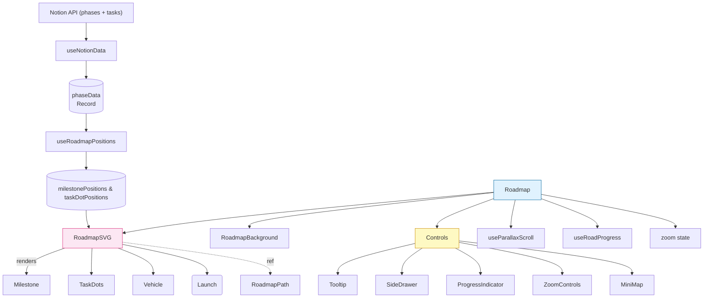

# How the Roadmap Visualisation Works

Below is a “bird’s-eye” tour of the moving pieces that turn raw Notion data into the animated, scrollable scene you see in the app.

---

## 1. Data layer – pulling content from Notion

1. **RoadmapViewer (page)** injects a configuration object containing database IDs & tokens via React Context.  
2. **`useNotionData`** (custom hook) uses that config to call the `/api/notion/phases-with-tasks` endpoint.  
3. The hook normalises the response into a flat `phaseData` map:

```18:62:app/hooks/useNotionData.ts
phaseDataMap[phase.phase] = {
  title, tagline, status, startDate, endDate, critical,
  tasks: [{ name, status }, …],          // one row per Notion task
  content: phase.content ?? [],          // rich-text blocks
  icon: phase.icon
}
```

4. While the fetch is happening, the main `Roadmap` component shows `<LoadingState/>`; errors fall back to `<ErrorState/>`.

---

## 2. Scene orchestration (`<Roadmap/>`)

The top-level component wires together *all* interactive parts:

```11:45:app/components/roadmap/Roadmap.tsx
const { phaseData, loading, error, refresh } = useNotionData();
const { milestonePositions, taskDotPositions, launchPosition, currentDot }
      = useRoadmapPositions({ pathRef, phaseData, circleRadius: 25 });
useParallaxScroll({ containerRef });
useRoadProgress({ phaseData });
```

Key responsibilities:

• Keeps local **zoom** & **selectedPhase** state.  
• Creates refs to the SVG path/container so helper hooks can sample geometry.  
• Renders:

```
┌──────────────── RoadmapHeader       (top bar + refresh/share)
│
├─RoadmapBackground  (landscape SVG, parallax layers)
│
├─RoadmapSVG         (actual road, milestones, dots, vehicle)
│
└─RoadmapControls    (tooltip, side drawer, zoom ±, minimap, progress bar)
```

*(A compact component diagram is embedded below.)*

---

## 3. Laying out the road & its stops

### 3.1. Static path

`app/utils/roadmapCurvePoints.ts` lists 19 control points.  
`<RoadmapPath/>` pipes them through `d3-shape`’s `line().curve(curveCatmullRom)` to get a silky spline that becomes our **road**.

```5:14:app/components/roadmap/RoadmapPath.tsx
const d = line().curve(curveCatmullRom.alpha(0.7))(points)!
```

Multiple over-laid strokes (dark asphalt, texture, double-yellow centre etc.) add depth; subtle “sparkle” circles animate along the road for polish.

### 3.2. Dynamic positions

`useRoadmapPositions` is the brains that transforms *data* into *screen coordinates*:

1. Measures full path length with `SVGPathElement.getTotalLength()`.
2. Slices that length into segments proportional to the number of tasks in each phase (with a minimum width so tiny phases still get space).
3. For every phase:
   • picks a single **milestone** position at the start of its segment  
   • distributes **task dots** along the same segment, avoiding collisions with each other *and* the milestone.  
   • returns a **currentDot** (the last `in-progress` task) for the animated “vehicle”.

Algorithm entry point:

```3:21:app/utils/roadmapPositions.ts
export const calculateRoadmapPositions = ({ pathElement, phaseData, circleRadius }) ⇒ { … }
```

---

## 4. SVG layer – what you actually see

Inside `<RoadmapSVG/>` everything is rendered in order:

1. `<RoadmapPath/>` – the road.
2. One `<Milestone/>` per phase (colour reflects status, icon overlay comes from Notion).
3. All `<TaskDots/>` (small coloured circles).
4. `<Vehicle/>` – a tiny animated car that bobs and its wheels spin at `currentDot`.
5. A “Launch” marker (end-of-road circle).

The whole `<svg>` is scaled via CSS `transform: scale(zoom)` whenever users press the zoom buttons.

---

## 5. UX helpers & overlays

| Feature | Code | Notes |
|---------|------|-------|
| Parallax background | `useParallaxScroll` + `LandscapeBackground` | Hills & cloud layers move at different speeds as you scroll horizontally. |
| Tooltip | `useTooltipHandlers` + `<Tooltip/>` | Appears on hover over milestones or task dots. |
| Phase details | `<SideDrawer/>` | Slides in from the right when a milestone is clicked; shows rich Notion content. |
| Minimap | `<MiniMap/>` | Scaled thumbnail of milestones; shows current position and lets you jump to any phase. |
| Progress bar | `<ProgressIndicator/>` + `useRoadProgress` | Animates road “shimmer” & bottom progress read-out (percentage of completed tasks). |
| Zoom | `<ZoomControls/>` | ± buttons adjust a local zoom state (0.5 → 3×). |

---

## 6. Styling, animation & responsiveness

• **TailwindCSS** classes are used for colours, spacing, shadows, hover states.  
• Pure CSS keyframes drive sparkles, vehicle bounce, wheel spin and parallax sky shifts.  
• The main scroll container is set to `overflow-x: auto; overflow-y: hidden;` to create the horizontal journey illusion on any screen width.

---

## 7. Putting it all together

Here’s a simplified flow diagram linking the major parts:



*Everything above runs entirely client-side, so once the initial fetch succeeds the roadmap stays buttery-smooth without further round-trips.*

---

### TL;DR

1. Fetch & shape data (`useNotionData`).  
2. Derive path-relative coordinates (`useRoadmapPositions`).  
3. Draw road + nodes in SVG (`<RoadmapSVG/>`).  
4. Overlay interactivity (tooltips, drawer, minimap, zoom).  
5. Spice it up with parallax & animations.  

That combination yields a visually engaging, data-driven journey map that’s both informative and fun to explore.